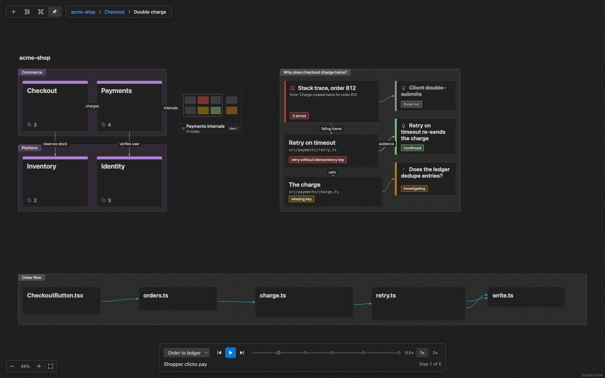

# VS Canvas

Put your codebase on an infinite canvas, inside VS Code. Build it yourself, or let your AI agent build it for you
over MCP.

- **Map a repo.** Services grouped into domains. Zoom in to see each one's entry points, then the real code.
- **Trace a bug.** Put the stack trace next to the code it points at, test hypotheses, and mark the root-cause line.
- **Follow the data.** Play back a flow and watch the payload move through the actual call sites.
- **Diff data over time.** Chain diff cards (`order.0.json` to `order.1.json` to `order.2.json`) under the code that changes them.
- **Draw diagrams.** Flowchart, UML, C4, ERD, architecture and BPMN shapes, alongside your code.

Canvases are plain `*.canvas.json` files that you commit next to your code. They store paths and line ranges,
never file contents.

## Get started

1. Run **VS Canvas: New Canvas**, or open any `*.canvas.json` file.
2. Drag an arrow out of any card and drop it to add the next one. Double-click a card to edit it.
3. Press Shift+S for the shape palette, or Cmd/Ctrl+K to search the canvas.

## Use it with an AI agent

Each window runs a local MCP server; the status bar shows its port.

- **VS Code agent mode** finds it automatically.
- **Claude Code:** run **VS Canvas: Set Up Claude Code for This Workspace**, then start `claude` in the project.
- **Teach your agents the canvas:** run **VS Canvas: Install Agent Skills** to add a short guide for Claude Code,
  Copilot, Cursor, Windsurf, Cline, Gemini CLI or `AGENTS.md`, so they know when and how to use it.

Then ask, for example: *"Map this repo's domains"* or *"Why does checkout charge twice? Build an investigation board."*

[Tools, settings and development guide](docs/development.md)
